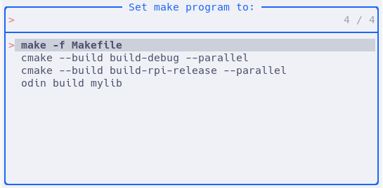

# Build Selector for Neovim

Utility to intelligently calculate likely `makeprg` targets to easily select a
build target. This allows follow-up use of `:make` commands to compile the
programs.

## Overview

Detects files such as `Makefile` and `CMakeLists.txt` and builds up options
that you may want to use as the vim `makeprg`.

## Usage

```
:BuildSelector
```

Or add a key-map such as

```lua
vim.keymap.set('n', '<leader>b', require('build-selector').choose_default)
```

This pops up the default ui-select menu with selections, e.g.

```sh
1. make -f Makefile
2. cmake --build build-debug --parallel
3. cmake --build build-rpi-release --parallel
4. odin build mylib
```

Or if using something like [telescope-ui-select](https://github.com/nvim-telescope/telescope-ui-select.nvim):


## Supported Formats

### Makefile

Detects `Makefile` and `makefile`, and adds options `make -f <FILE>`

### CMake

Detects `CMakeLists.txt` and then searches for `build*/CMakeCache.txt` and adds
`cmake --build <PATH> --parallel` for each of them.

### Odin

Detects `*.odin` and then adds `odin build <dir>` for each of unique directory.

### Devcontainers

Detects `.devcontainer.json`, `.devcontainer/devcontainer.json`,
`.devcontainer/*/devcontainer/json` (depth one) to find devcontainers.

Each devcontainer duplicates previous entries with
`docker exec <NAME> <COMMAND>` where `NAME` is the devcontainer name, and
`COMMAND` is one of the earlier detected makeprg options. For example,

```
docker exec MyContainerName cmake --build build-gcc-debug --parallel
```

## Setup

Using [Lazy.nvim](https://github.com/folke/lazy.nvim):

```lua
{
    "segcore/build-selector.nvim",
    dependencies = {
        "nvim-lua/plenary.nvim", -- Optional; to simplify file paths
    },
    opts = {},
}
```

Available options, documented with their default values:

```lua
opts = {
    simplify = true, -- Simplify file paths relative to the current working directory
    add_command = true, -- Add the :BuildSelector user command
    selected_callback = function(item) vim.opt.makeprg = item end, -- Called when an item is selected
}
```

A more extravagant example:

```lua
{
    "segcore/build-selector.nvim",
    config = function()
        local bs = require('build-selector')
        bs.setup({ simplify = false })
        vim.keymap.set('n', '<leader>b', bs.choose_default, { desc = 'Open build selector' })
        vim.keymap.set('n', '<leader>B', function()
            local choices = bs.choices()
            choices = vim.tbl_filter(function(entry)
                return string.match(entry, "docker")
            end, choices)
            bs.choose(choices)
        end, { desc = 'Open build selector for docker builds' })
    end,
},
```
